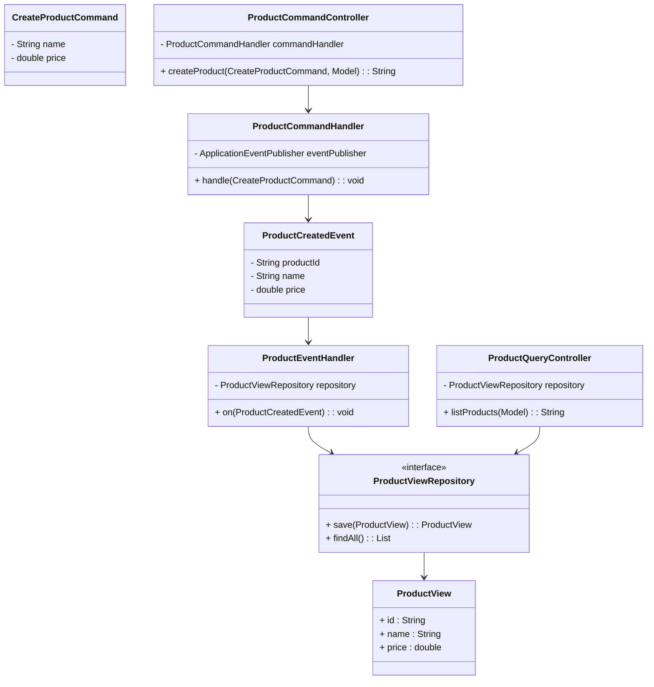

Below is a sample `README.md` that you might include with your project. It describes the purpose of the application, shows the architecture using Mermaid diagrams, and explains the data flow. Adjust details as necessary to match your actual implementation.

---

# CQRS Event-Driven Demo Application

This is a simple Spring Boot application demonstrating a CQRS (Command Query Responsibility Segregation) pattern within an event-driven architecture. It uses:

- **Command side**: Handles create operations and publishes domain events.
- **Query side**: Listens for events and updates a read model for fast queries.
- **Thymeleaf**: For rendering a simple UI to create and list products.
- **In-memory H2 Database**: For storing the query-side read model.
- **Spring Data JPA**: For data access on the query side.
- **Spring Application Events**: For event publication and consumption within the same service.

## Key Concepts

**CQRS** separates the responsibilities of reading and writing data:
- **Command side (writes)**: Processes commands like *create product*, validates input, applies business rules, and emits events describing what happened.
- **Query side (reads)**: Listens to the emitted events and updates a read-optimized model (e.g., a simple `ProductView` table) that can be queried directly.

**Event-Driven** architecture ensures the command side does not directly update the query model. Instead, it emits events that the query side listens for and reacts to.

## How It Works

1. A user submits a "Create Product" form via a web interface.
2. The `ProductCommandController` receives the request and issues a `CreateProductCommand`.
3. The `ProductCommandHandler` processes the command:
    - Validates the input.
    - Generates a product ID.
    - Publishes a `ProductCreatedEvent`.
4. The `ProductEventHandler` (on the query side) listens for `ProductCreatedEvent`:
    - Updates the `ProductView` entity in the database.
5. The `ProductQueryController` displays the updated list of products, reading from the `ProductViewRepository`.

## Class Diagram

## Data Flow Diagram

```mermaid
flowchart LR

A[User] -->|Submit form: name, price| B[ProductCommandController]
B -->|CreateProductCommand| C[ProductCommandHandler]
C -->|Validate & Publish| D[ProductCreatedEvent]
D -->|Handled by| E[ProductEventHandler]
E -->|Update| F[ProductViewRepository]

F -->|H2 DB Query| G[ProductQueryController]
G -->|Render Thymeleaf Template| H[User sees product list]
```

**Explanation:**

1. **User** enters a product name and price in the browser form.
2. On submit, the **ProductCommandController** creates a `CreateProductCommand` and passes it to the **ProductCommandHandler**.
3. The **ProductCommandHandler** validates input and publishes a `ProductCreatedEvent`.
4. The **ProductEventHandler** listens for the `ProductCreatedEvent` and updates the `ProductView` read model via the **ProductViewRepository**.
5. When the user (or another request) hits the **ProductQueryController**, it fetches the latest `ProductView` data from the repository and displays it via a Thymeleaf template.

## Running the Application

1. Ensure you have Java 17+ and Maven installed.
2. Run `mvn spring-boot:run` from the project root.
3. Access `http://localhost:8080/products` to view the products page.
4. Create a product and observe it appears in the product list after submission.

This simple setup demonstrates how CQRS and event-driven architectures can be implemented in a small, monolithic Spring Boot application. It can be later extended to a distributed setup, integrate a message broker, or incorporate a proper event store.

